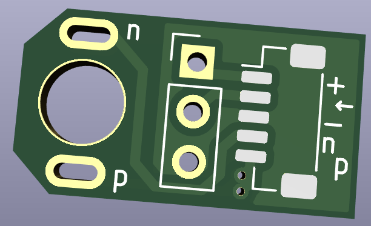
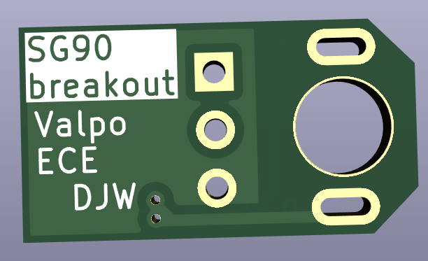

= (Re)Build a servo from parts
stolen from an SG90 servo

== TODO

* [x] Check pot polarity against labels and rotation.
* [x] Check motor polarity against labels and rotation.

== SG-90 modification

Remove the PCB from an SG-90.
Breakout the motor wires and pot wires.

JST PH 1.0mm 5-pin connector `BM05B-SRSS-TB` or `SM05B-SRSS-TB` for right-angle or normal to the board cable exit direction.

